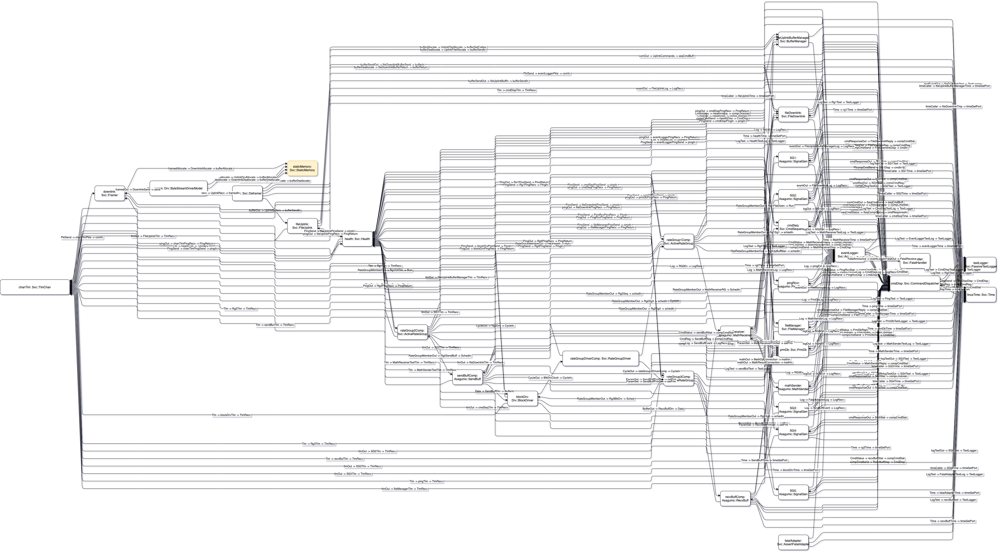

# fprime-top2diagrams.net

Simple script to generate Diagrams.net diagrams of topology files for FPrime framework. This script was created for internal usage.

Feel free to create issues, pull reguests and discussions.

## How to use

1. Clone this repo:

    `git clone git@github.com:spacebit-apps/fprime-top2diagrams.net.git`
2. Change directory:

    `cd fprime-top2diagrams.net`
3. Install requirements:

    `pip3 install -r requirements.txt`

4. Run script:

    `python3 top2drawio.py path_to_top_xml_file [output_file]`

    By default output_file is set to Top.drawio.

5. To view generated *.drawio file please use [Desktop Diagrams.net](https://github.com/jgraph/drawio-desktop/)releases] application.

6. Improved layouting can be done via Diagrams.net application menu: Arrange -> Layout

## Example

Diagram of the Ref application can be found on the Output/Ref.drawio folder. Layouting was done via Diagrams.net capabilites.

## Acknowledgments

1. [N2G](https://github.com/dmulyalin/N2G) lib that helps to generate Diagrams.net diagrams in Python
2. [Diagrams.net](https://diagrams.net) for great diagrams tools
3. Thanks NASA for [FPrime](https://github.com/nasa/fprime) - a great framework for space missions
